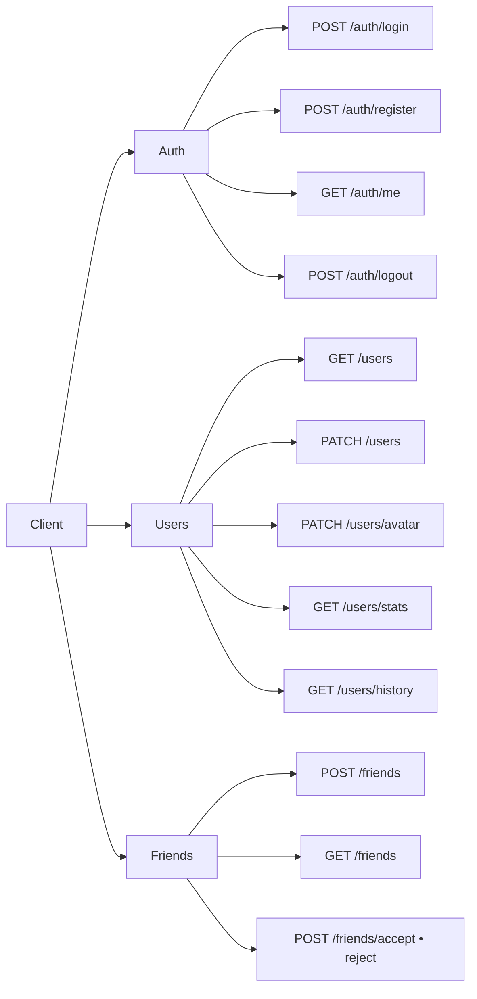

# Chess API Documentation

## Base URL

Swagger UI:

```
https://localhost:4443/api/docs
```

Swagger json:

```
https://localhost:4443/api/docs-json
```

---

# API Overview



---

## Authentication

Most endpoints require a Bearer token:

```
Authorization: Bearer <token>
```

---

# Auth

## POST `/auth/login`

Authenticate user with username and password.

### Request Body
```json
{
  "username": "string",
  "password": "string"
}
```

### Responses

- **200 OK**
```json
{
  "accessToken": "string",
  "userId": "string",
  "username": "string"
}
```

- **400 Bad Request** – Missing credentials  
- **401 Unauthorized** – Invalid credentials

---

## POST `/auth/register`

Register a new user.

### Request Body
```json
{
  "email": "string",
  "username": "string",
  "password": "string"
}
```

### Responses

- **201 Created**
```json
{
  "accessToken": "string",
  "userId": "string",
  "username": "string"
}
```

- **400 Bad Request** – Invalid input  
- **409 Conflict** – Email or username already exists  

---

## GET `/auth/me`

Check if user is authenticated.

### Responses

- **200 OK**
```json
{
  "isConnected": true,
  "username": "string"
}
```

- **401 Unauthorized**

---

## POST `/auth/logout`

Logout current user.

### Responses

- **200 OK**
```json
true
```

- **401 Unauthorized**

---

## GET `/auth/game`

Retrieve user information for game session.

### Responses

- **200 OK**
```json
{
  "userId": "string",
  "username": "string",
  "fingerprint": "string"
}
```

- **401 Unauthorized**

---

# Users

## GET `/users`

Retrieve all users.

### Security
Bearer token required

### Responses

- **200 OK**
```json
[
  {
    "username": "string",
    "id": "string",
    "firstName": "string",
    "bio": "string",
    "isOnline": true,
    "avatarUrl": "string",
    "statistics": {
      "bulletElo": 0,
      "blitzElo": 0,
      "rapidElo": 0
    }
  }
]
```

---

## PATCH `/users`

Update user profile.

### Security
Bearer token required

### Request Body
```json
{
  "username": "string",
  "email": "string",
  "firstName": "string",
  "lastName": "string",
  "bio": "string",
  "avatarUrl": "string"
}
```

### Responses

- **200 OK**
```json
{
  "user": {
    "username": "string",
    "id": "string",
    "firstName": "string",
    "lastName": "string",
    "bio": "string",
    "avatarUrl": "string"
  }
}
```

- **400 Bad Request**  
- **401 Unauthorized**  
- **409 Conflict**

---

## DELETE `/users`

Delete current user account.

### Security
Bearer token required

### Responses

- **200 OK**
```json
{
  "id": "string",
  "username": "string",
  "email": "string"
}
```

- **401 Unauthorized**

---

## PATCH `/users/password`

Change user password.

### Security
Bearer token required

### Request Body
```json
{
  "oldPassword": "string",
  "newPassword": "string"
}
```

### Responses

- **200 OK**
```json
{
  "user": { },
  "accessToken": "string"
}
```

- **400 Bad Request**  
- **401 Unauthorized**

---

## PATCH `/users/avatar`

Upload user avatar.

### Security
Bearer token required

### Content-Type
`multipart/form-data`

### Form Data

```
avatar: <file>
```

### Constraints

- Allowed formats: png, jpg, jpeg, webp
- Max size: 5MB

### Responses

- **200 OK**
```json
{
  "username": "string",
  "id": "string",
  "avatarUrl": "string"
}
```

- **400 Bad Request**  
- **401 Unauthorized**

---

## GET `/users/me`

Get current user profile.

### Responses

- **200 OK**
```json
{
  "username": "string",
  "email": "string",
  "firstName": "string",
  "lastName": "string",
  "bio": "string",
  "avatarUrl": "string"
}
```

- **401 Unauthorized**

---

## GET `/users/stats`

Get user statistics.

### Responses

- **200 OK**
```json
{
  "username": "string",
  "avatarUrl": "string",
  "memberSince": "string",
  "totalGames": 0,
  "avgScore": 0,
  "bulletRating": 0,
  "blitzRating": 0,
  "rapidRating": 0,
  "currentStreak": 0,
  "bestStreak": 0
}
```

- **401 Unauthorized**

---

## GET `/users/elo-history`

Retrieve Elo rating history (last 30 days).

### Responses

- **200 OK**
```json
{
  "bullet": [{ "date": "string", "rating": 0 }],
  "blitz": [{ "date": "string", "rating": 0 }],
  "rapid": [{ "date": "string", "rating": 0 }]
}
```

- **401 Unauthorized**

---

## GET `/users/history`

Retrieve recent game history.

### Responses

- **200 OK**
```json
[
  {
    "id": "string",
    "date": "string",
    "opponent": "string",
    "result": "Win | Loss | Draw",
    "moves": 0,
    "mode": "Bullet | Blitz | Rapid",
    "side": "White | Black"
  }
]
```

- **401 Unauthorized**

---

## GET `/users/{id}`

Get user by ID.

### Responses

- **200 OK**
- **404 Not Found**

---

## GET `/users/email/{email}`

Get user by email.

### Responses

- **200 OK**
- **404 Not Found**

---

## GET `/users/username/{username}`

Get user by username.

### Responses

- **200 OK**
- **404 Not Found**

---

# Friends

## POST `/friends`

Send a friend request.

### Security
Bearer token required

### Request Body
```json
{
  "toUsername": "string"
}
```

### Responses

- **201 Created**
```json
{
  "id": "string",
  "fromUserId": "string",
  "toUserId": "string",
  "status": "PENDING"
}
```

- **400 Bad Request**  
- **404 Not Found**  
- **409 Conflict**

---

## GET `/friends`

Retrieve list of friends.

### Responses

- **200 OK**
```json
[
  {
    "id": "string",
    "username": "string",
    "avatarUrl": "string",
    "elo": 0,
    "status": "online",
    "currentStreak": 0,
    "bestStreak": 0,
    "bio": "string"
  }
]
```

---

## GET `/friends/request`

Retrieve pending friend requests.

### Responses

- **200 OK**
```json
[
  {
    "id": "string",
    "username": "string",
    "avatarUrl": "string"
  }
]
```

---

## POST `/friends/accept/{id}`

Accept friend request.

### Responses

- **200 OK**
- **404 Not Found**

---

## POST `/friends/reject/{id}`

Reject friend request.

### Responses

- **200 OK**
```json
{
  "success": true
}
```

- **404 Not Found**

---

# Static Files

Avatar files are accessible via:

```
/api/uploads/<filename>
```

---


# Notes

- All routes are prefixed with `/api`
- JWT authentication is required for most endpoints
- File uploads are handled via Multer
- Avatar files are stored locally and served via Nginx
- Rate limiting is enabled on API routes