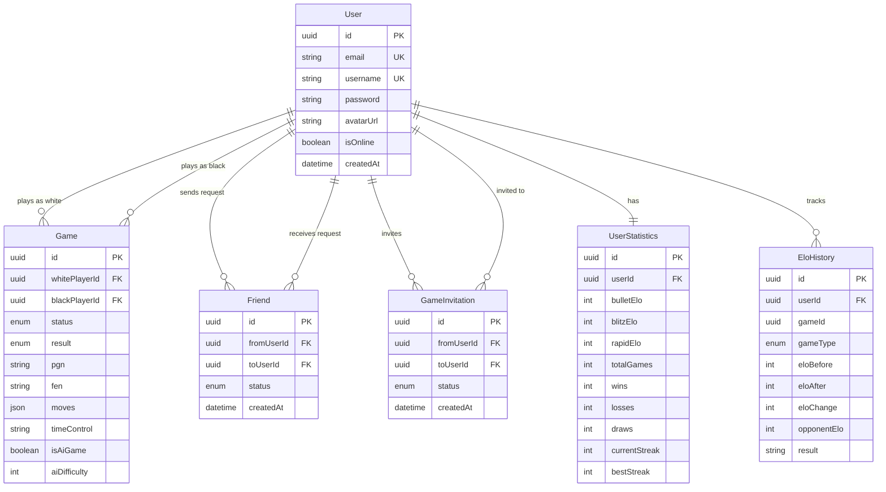

*This project has been created as part of the 42 curriculum by beboccas, bschmid, cbopp, sforster*

# 42 Chess

## Description

An online chess platform built as the final project of the 42 Common Core. The platform offers real-time multiplayer chess matches, AI opponents powered by Stockfish at variable difficulty levels, player statistics with Elo ratings and a spectator mode.

**Key features:**
- Real-time multiplayer chess with WebSocket-based game synchronization
- Variable time controls (e.g., 3+2, 5+0, 10+0) with additive increment
- AI opponent powered by Stockfish (UCI protocol, multiple difficulty levels)
- Per-time-control matchmaking queues
- Spectator mode for live games
- Player statistics and Elo rating system
- Custom chess engine (TypeScript, no external chess libraries)
- Friends system (Possibility to see friends activity)

## Instructions

### Prerequisites

- Docker and Docker Compose (v2+)
- Git
- A `.env` file configured from `.env.example`

### Environment Variables

See `.env.example` for a full list of required variables, including:
- `POSTGRES_USER`, `POSTGRES_PASSWORD`, `POSTGRES_DB` - database credentials

### Setup

1. Clone the repository:
```bash
  git clone https://github.com/LilBoooopp/transcendence.git
  cd transcendence
```

2. Build and start all services:
```bash
  make
```
  This will automatically initialise git submodules, generate SSL certificates, create the `.env` file (with a random JWT secret), and start all Docker containers.

3. The application will be available at `https://localhost:4443` (Nginx reverse proxy with HTTPS).

### Documentation

- **API Documentation:** The REST API is documented with Swagger. Once the application is running, visit [`https://localhost:4443/api/docs`](https://localhost:4443/api/docs) to explore all endpoints interactively.
- **Browser Compatibility:** See [BROWSER_COMPATIBILITY.md](BROWSER_COMPATIBILITY.md) for detailed testing notes on Chrome, Firefox, and Safari.

### Development

To run individual services in development mode:
```bash
# Frontend only
cd frontend && npm install && npm start

# Backend only
cd backend && npm install && npm run start
```

## Team Information

| Login | Name | Role(s) |
|-------|------|---------|
| cbopp | Charlie Bopp | Product Owner, Developer |
| bschmid | Bastian Schmid | Project Manager, Developer |
| sforster | Sylvie Forster | Technical Lead, Developer |
| beboccas | Bertrand Boccassino | Developer |

### Responsibilities

- **cbopp (Product Owner, Developer)** - Defined product vision and feature priorities. Maintained the product backlog. Implemented WebSocket infrastructure (Socket.IO gateway, real-time game synchronization, matchmaking queues, spectator mode).

- **bschmid (Project Manager, Developer)** - Facilitated team coordination, tracked progress, and organized sprints. Designed and built the entire React frontend (all UI components except the chess game view), established the corporate design system (color palette, typography, component styles), created a reusable Tailwind CSS component library, optimized the UI for mobile devices, and prepared frontend data interfaces for API integration. Co-implemented the notification system.

- **sforster (Technical Lead, Developer)** - Defined the technical architecture and made key technology decisions. (Backend API routes, NestJS architecture (services, controllers, guards), authentication system, rate limiting, user management, friends management)

- **beboccas (Developer)** - Worked across the full stack to bridge REST API and real-time components. Collaborated on the secure user authentication flow (registration, login, JWT session management). Contributed to the Socket.IO gateway, game room management, and event broadcasting for matchmaking and spectator modes. Refactored the frontend router and integrated loaders to centralize API calls and streamline error handling.

## Project Management

### Work Organization

We divided the project into specialized tracks based on our individual strengths, while maintaining a collaborative approach for feature integration.

 * **Frontend & UI/UX:** Bastian took ownership of the React frontend, establishing a unified corporate design, building the reusable component library with Tailwind CSS, and ensuring the application was fully responsive on mobile devices.

 * **Backend REST API & Infrastructure:** Sylvie lead the core backend architecture using NestJS. She designed the API routes, implemented the secure JWT authentication flow, managed the database schema (Prisma/PostgreSQL), and handled Docker containerization.

 * **Real-Time Gateway & Game Engine:** Charlie focused on the live, stateful elements of the application. This included building the Socket.IO gateway, developing the matchmaking queues, implementing the custom TypeScript chess engine, and integrating the Stockfish AI subprocess.

 * **Full-Stack & Feature Support:** Bertrand worked across the stack, collaborating on both the user authentication flow alongside Sylvie and the real-time WebSocket implementations alongside Charlie.

We organized our development cycle into one-week sprints. Tasks were created, assigned, and tracked using GitHub Projects. To maintain code quality, we enforced branch rules requiring pull requests and code reviews before merging any features into the main branch.

### Tools Used

- **Version control:** GitHub with branch rulesets (PR-before-merge, no force push, restricted deletions)
- **Task tracking:** GitHub Issues and Projects.
- **Communication:** a Discord server with categorized channels and a webhook linked to the Github repository to receive updates and changes as notifications.

### Meetings
We made it a priority to hold an official meeting once a week as a complete group to discuss our general progress and outline our next steps. Outside of these weekly syncs, we collaborated regularly on an ad-hoc basis. This frequent communication was especially important when our individual sections intersected, allowing us to help each other, understand new concepts, and ensure seamless integration of everyone's work into the final project.

## Technical Stack

### Frontend
- **React + TypeScript** - component-based UI with strong typing
- **Tailwind CSS** - utility-first styling for rapid, consistent design
- **Socket.IO client** - real-time bidirectional communication with the backend
- **React Router** - client-side routing (`/game/:gameId`, `/play`, `/bot-launch`, etc.)

### Backend
- **NestJS + TypeScript** - structured, modular server framework well-suited to WebSocket gateways and REST APIs
- **Socket.IO (server)** - manages game rooms, matchmaking queues, and live event broadcasting
- **Stockfish** - AI chess engine integrated as a persistent sub process via the UCI protocol; chosen as a subprocess (not a library) so the team retains full understanding of the chess logic
 
### Database
- **PostgreSQL 15** - chosen for its reliability, relational integrity, and strong support for complex queries (Elo calculations)
- **Prisma ORM** - type-safe query builder that integrates directly with TypeScript; eliminates raw SQL boilerplate while keeping the schema version-controlled

### Chess Engine
- **Custom TypeScript engine** - implemented from scratch (no external chess libraries) as a git submodule shared between the frontend and backend. Includes move generation, legal move validation, check/checkmate/stalemate detection, and a minimax AI with alpha-beta pruning and MVV-LVA move ordering.

### Infrastructure
- **Docker + Docker Compose** - each service (frontend, backend, database, nginx) runs in its own container for reproducibility
- **Nginx** -reverse proxy handling HTTPS termination and routing between frontend and backend

## Database Schema



## Features List

| Feature | Description | Implemented by |
|---------|-------------|----------------|
| Real-time multiplayer | Two players matched via queue play chess live with WebSocket sync | cbopp |
| Variable time controls | Supports time+increment format (e.g., 3+2); parsed and enforced server-side | cbopp |
| Matchmaking queues | Per-time-control queues; players are paired automatically | cbopp |
| AI opponent (Stockfish) | Bot games against Stockfish at configurable depth; UCI subprocess per game | cbopp |
| Custom chess engine | Full move generation and validation without external libraries | cbopp |
| Spectator mode | Any authenticated user can watch a live game is read-only mode | cbopp |
| Elo ratings | Rating updates after each rated game using standard Elo formula | cbopp |
| User profiles | View your own stats, game history, and rating | bschmid, sforster |
| User authentication | Registration, login, JWT-based sessions | beboccas, sforster |
| Friends management | Send, accept, or decline friend requests; view online status or spectate friends | everyone |
| Global Leaderboard & Stats | Track wins, losses, draws, streaks, and display ranked leaderboards based on Elo | everyone |
| Match History | View past games, including dates, opponents, results, and PGNs | everyone |
| Notification System | Real-time toast notifications for game events and system alerts | bschmid, cbopp |
| Responsive UI & Design | Custom component library built with Tailwind CSS, optimized for all devices | bschmid |
| Public REST API | Secured endpoints for user data and game history with rate limiting | beboccas, sforster |

## Modules

**Total: 20 points** (7 major * 2pts + 6 minor * 1pt - see breakdown below)

### Web (9 points)

| Module | Type | Points | Implementation | Member(s) |
|--------|------|--------|----------------|------------|
| Frontend + Backend frameworks (React/NestJS) | Major | 2 | React/TypeScript SPA served via Vite; NestJS REST WS gateway | everyone |
| Real-time WebSocket features | Major | 2 | Socket.IO gateway with rooms, matchmaking, spectator events | beboccas, cbopp |
| ORM (Prisma) | Minor | 1 | Prisma schema + migrations; type-safe DB access throughout backend | everyone |
| Custom-made design, reusable components | Minor | 1 | Shared component library (GamePage, MatchmakingWaiting, etc.) with Tailwind | bschmid |
| Notification system | Minor | 1 | Implemented Toast-type notifications to inform user of various events. | bschmid, cbopp |
| Public API | Major | 2 | RESTful Application Programming Interface (API) for authentication, users and friends management (see `/api/docs`) | beboccas, sforster |

### Accessibility and Internationalization (1 point)

| Module | Type | Points | Implementation | Member(s) |
|--------|------|--------|----------------|-----------|
| Support for additional browsers | Minor | 1 | Compatibility with Firefox and Safari | everyone |

### User Management (3 points)

| Module | Type | Points | Implementation | Member(s) |
|--------|------|--------|----------------|-----------|
| Standard user management | Major | 2 | Display and update informations, upload avatar, friends management  | everyone |
| Game statistics | Minor | 1 | Saves and displays all information about game results, elo changes, match histories and win streaks | everyone |

### Gaming (7 points)

| Module | Type | Points | Implementation | Member(s) |
|--------|------|--------|----------------|-----------|
| Web-based chess game | Major | 2 | Custom TS engine (flat 64-array board, full rules) | cbopp |
| Remote players | Major | 2 | Socket.IO rooms with role assignment (white/black/spectator) and reconnect handling | beboccas, cbopp |
| AI opponent (stockfish) | Major | 2 | Stockfish binary as persistent UCI subprocess per bot game | cbopp |
| Watch live games | Minor | 1 | Spectators join game rooms in read-only mode | cbopp |

## Individual Contributions

### cbopp (Charlie Bopp)
- Designed and implemented the entire WebSocket layer: Socket.IO gateway, game rooms, matchmaking system, reconnect logic.
- Built the time control system with additive increment and per-time-control queue routing.
- Integrated Stockfish as a UCI subprocess with persistent process management per bot game.
- Refactored frontend game logic into reusable hooks (`useGameSetup`, `useChessGame`) and shared components.
- **Challenges:** Stale closures in Socket.IO callbacks required refs for all mutable game state; socket timing required defensive checks for already-connected sockets; bot reconnect logic needed explicit branches since bot games set `gameStarted: true` immediately.

### bschmid (Bastian Schmid)
- Designed and implemented frontend: created all UI components except chessGame
- Implemented coherent UI design
- Created reusable component library
- Created corporate design: color, font and style for components
- Organized meetings
- Setup GitHub Project
- Maintained GitHub Project and distributed tasks
- Optimized UI for mobile
- Prepared frontend data-interfaces for API calls

**Challenges:**
- Getting a coherent UI that is nice on all devices
- Finding the balance of using Mock data, Mock API calls and preparing to receive real data
- Decide when to do a new component or add to an existing one

### sforster (Sylvie Forster)
- Design and implement the entire API routes. 
- Structured the backend architecture (services, controllers, guards, DTO validation)
- Built the user authentication flow using NestJS, including login/logout logic, JWT handling, and route protection with guards
- Implemented rate limiting and security hardening on both NestJS and Nginx
- Developed user management features such as profile access, profile updates, and user deletion
- Prototype html page for login and users (for api call)
- Git template
- Participate to docker implementation
- Contributed to Docker integration and overall backend setup
- Implement friends management

### beboccas (Bertrand Boccassino)
- Full-Stack Integration: Worked across the stack to bridge the REST API and real-time components, ensuring seamless communication between the frontend and backend.
- Authentication & Security: Collaborated with Sylvie to build the secure user authentication flow, including user registration, login, and JWT-based session management.
- Real-Time Communication: Paired with Charlie to implement the WS infrastructure, contributing to the Socket.IO gateway, game room management, and event broadcasting for matchmaking and spectator modes
- Using Loaders on the React Router: Refactored router and integrated loaders to centralize API calls and facilitate error handling. 
**Challenges:**
- Last minute full refactor of frontend API implementations. Changed `BrowserRouter` + `Route` to `RouterProvider` + `createBrowserRouter()` in order to use Router Loaders and avoid multiple calls on API endpoint or causing rate limit.

## Resources

- [React Documentation](https://react.dev/)
- [NestJS Documentation](https://docs.nestjs.com/)
- [Prisma Documentation](https://www.prisma.io/docs)
- [chess.js](https://github.com/jhlywa/chess.js)
- [Stockfish](https://stockfishchess.org/)
- [Stockfish UCI Protocol](https://www.schredderchess.com/chess-features/uci-universal-chess-interface.html)
- [PostgreSQL Documentation](https://www.postgresql.org/docs/)
- [Elo Rating System](https://en.wikipedia.org/wiki/Elo_rating_system)

### Tutorials

- [NestJS Controllers](https://docs.nestjs.com/controllers)
- [NestJS Concepts](https://youtu.be/IdsBwplQAMw?si=oAu46pcgzciqx4dj)
- [NestJS Authentication](https://youtu.be/i-howKMrtCM?si=pm7ZRD6mTZmuodSb)
- [NestJS Architecture](https://youtu.be/vIP0iH3q3oc?si=4kuGUW-mNGS-Nkzj)
- [Node Package Manager](https://www.w3schools.com/whatis/whatis_npm.asp)
- [TypeScript](https://www.w3schools.com/typescript)
- [JavaScript](https://www.w3schools.com/js/js_intro.asp)
- [NodeJS Concepts](https://www.youtube.com/watch?v=q-xS25lsN3I)
- [REST API](https://www.geeksforgeeks.org/node-js/rest-api-introduction)
- [REST API](https://learn.microsoft.com/en-us/azure/architecture/best-practices/api-design)
- [Prisma Concepts](https://youtu.be/rLRIB6AF2Dg?si=Mq9R75zedI5CHr4q)
- [Prisma Relationships](https://youtu.be/fpBYj55-zd8?si=kyxVMuKvGfTI3tyr)
- [JWT Concepts](https://www.youtube.com/watch?v=7Q17ubqLfaM)

### AI Usage

AI tools were used during the development of this project for the following purposes:

- Understand the project stack and architecture
- Explore the codebase and component interactions
- Assist with debugging
- Help implement some TypeScript functions
- Documentation editing

All generated suggestions were reviewed, tested, and adapted before being integrated into the project

## Project Structure
```
chess-platform/
├── docker-compose.yml
├── .env.example
├── .gitignore
├── backend/
│   ├── Dockerfile
│   ├── package.json
│   ├── tsconfig.json
│   ├── nest-cli.json
│   ├── src/
│   │   └── chess/          # Chess engine submodule
│   └── prisma/
│       └── schema.prisma
├── frontend/
│   ├── Dockerfile
│   ├── package.json
│   ├── tsconfig.json
│   └── tailwind.config.js
├── database/
│   └── init.sql
└── nginx/
    ├── Dockerfile
    ├── nginx.conf
    └── ssl/
```

## License

Educational project for 42 School.

